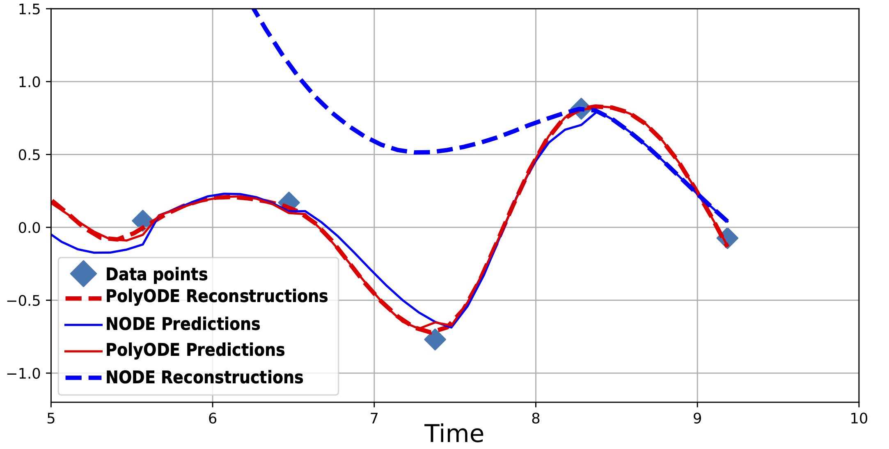

# Anamnesic Neural Differential Equations with Orthogonal Polynomials Projections

## Installing the package

The dependencies for the project are in `pyproject.toml`. You can create an environement with conda or poetry.

## Training PolyODEs

The experiments showed in the paper happen in two steps. The first steps trains the PolyODE on forecasting. The second step freezes the embeddings learnt by this representation and trains an auxiliary classifier or regressor depeding on the nature of the downstream task.

### Forecasting. 

To train the PolyODE on forecasting : 

`cd train_scripts`

`python train_node.py --model_type=CNODExt --data_type={Lorenz,SimpleTraj,MIMIC} --irregular_rate=0.3 --method=implicit_adams`

The following commands are used for the different datasets:

#### Synthetic

`python train_node.py --model_type=CNODExt --data_type=SimpleTraj --delta_t=0.05 --extended_ode_mode=true --irregular_rate={0.7,0.8,0.9} --method=implicit_adams`

#### Lorenz

`python train_node.py --model_type=CNODExt --data_type=Lorenz --Nobs=100 --delta_t=0.05 --extended_ode_mode=true --irregular_rate={0.3,0.4,0.5} --method=implicit_adams --lorenz_dims=2 --mode_96=false`

#### Lorenz96

`python train_node.py --model_type=CNODExt --data_type=Lorenz --Nobs=100 --delta_t=0.05 --extended_ode_mode=true --irregular_rate={0.3,0.4,0.5} --method=implicit_adams --lorenz_dims=4 --mode_96=true`

#### MIMIC

`python train_node.py --model_type=CNODExt --data_type=MIMIC --Delta=10 --extended_ode_mode=true --hidden_dim=18  --method=implicit_adams --lorenz_dims=4 `
### Classification and Regression

To train a model on the resulting embeddings, one can use the `classif.py` script.

For instance:

`python classif.py --Nobs=100 --data_type=Lorenz --init_sweep_id={the id of the sweep you used for the pre-training part} --lorenz_dims=2 --model_type=CNODExt --pre_compute_ode=True --regression_mode={true,false}`
